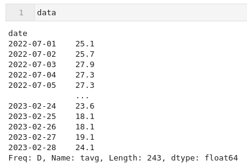
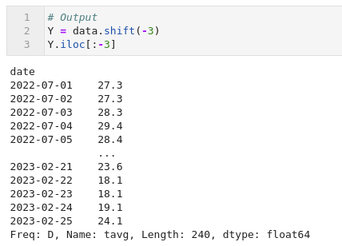
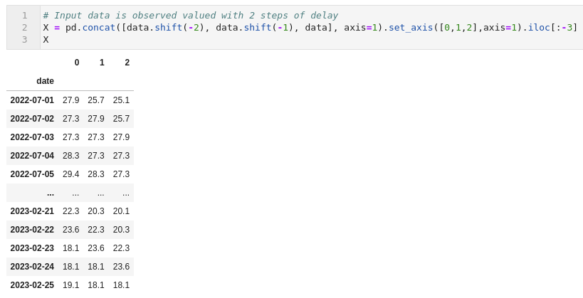

This script uses AutoRegressive gaussian modeling


Results using:

`python GPFitScriptINDEPENDENT.py -i "test_GMLV\simulations0.csv"`


For example, you define and train your model like this:
```python
model = gpflow.models.GPR(
    (X, Y),
    kernel=gpflow.kernels.SquaredExponential(),
)
opt = gpflow.optimizers.Scipy()
opt.minimize(model.training_loss, model.trainable_variables)
```

then it's just a matter of organizing your X and Y. For example, if your data is on Pandas, you can do it like this:

```python
# data is a Pandas Series object

# Input data is observed valued with 2 steps of delay
X = pd.concat([data.shift(-2), data.shift(-1), data], axis=1).set_axis([0,1,2],axis=1).iloc[:-3]

# Output
Y = data.shift(-3).iloc[:-3]

# Turn into Numpy arrays
X = X.values
Y = Y.values.reshape(-1,1)
```





